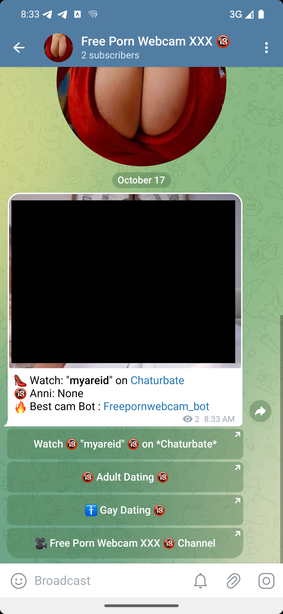

# TrimoonCam2Telegram

TrimoonCam2Telegram is a python tool that publish cams links taken from Adult Cam site's API directly on Telegram Channel/groups you manage

# Buy me a Beer 🍻
If you wish support me you can buy me a Cripto Beer

### Bitcoin:
[](bitcoin:bc1qks9svw4udfgh23dn3n92jmlkh2hx4sudytdlg9)

### BNB Smart Chain:
[](https://bscscan.com/address/0x80AAF991580685b39c618a0708884d05d8EB137f) 
[](https://bscscan.com/address/0x80AAF991580685b39c618a0708884d05d8EB137f) 
[](https://bscscan.com/address/0x80AAF991580685b39c618a0708884d05d8EB137f) 
[](https://bscscan.com/address/0x80AAF991580685b39c618a0708884d05d8EB137f)  
[](https://bscscan.com/address/0x80AAF991580685b39c618a0708884d05d8EB137f) 
[](https://bscscan.com/address/0x80AAF991580685b39c618a0708884d05d8EB137f)

All Donors Will be part of the sponsorship Div

## Limitation:

1. You can't remove Link to Channel [Free Porn Webcam XXX 🔞](https://t.me/freepornwebcam)
2. You can't remove link to BOT [@Freepornwebcam_bot](https://t.me/Freepornwebcam_bot)

## Supported Live Cams Websites API:
To make money with TrimoonCam2Telegram you need to create affiliate account on the following websites:

1. [Chaturbate.com](https://chaturbate.com/in/?tour=07kX&campaign=f83lA&track=default) - Create [Affiliate Account @ Chaturbate](https://chaturbate.com/in/?tour=07kX&campaign=f83lA&track=default) to start
2. [BongaCams.com](https://bongacash.com/ref?c=310566) - Create [Affiliate Account @ Bongacams](https://bongacash.com/ref?c=310566) to start
3. [CamSoda.com](https://partners.camsoda.com/signup?id=seoserviceit) - Create [Affiliate Account @ Camsoda](https://partners.camsoda.com/signup?id=seoserviceit) to start

### Future support for:
1. Livejasmin;
2. Cam4;
3. Streammate;

## Telegram Bot Setup:
1. Open Telegram (Mobile or Desktop);
2. Look for the "BotFather" https://t.me/BotFather
3. Create new Bot and save the Token
4. Start the new Bot and add it to your channel

## Installation:
1. Install [Python](https://www.python.org)
2. Create a Virtual Env: ``` python3.7 -m venv TrimoonCam2Telegram-venv ```
3. Than Activate your brand new Venv ``` source absolute\path\to\TrimoonCam2Telegram-venv\bin\activate ```

### How to setup the package from GIT:

1. Clone the TrimoonCam2Telegram git repository ```pip install git+https://github.com/trimoon056/TrimoonCam2Telegram.git```
2. Install setuptools ```pip install setuptools```
3. ``` python3.7 absolute\path\to\TrimoonCam2Telegram\setup.py install ```

### How to setup the package from PIP:

1. ```pip install TrimoonCam2Telegram```

## How to use The Project:
1. Create a new .py file (ex. botlauncher.py)
2. Create the Tracking dictionary
```python
CamTrackingDict = {
    'woopyxxx_chaturbate_aff_campaign_id' : 'your Cb Tracking ID', # the one after &campaign=
    'woopyxxx_bongacams_aff_id' : 'your Bongacams Tracking ID', # the one after &c=
    'woopyxxx_camsoda_aff_id' : 'your Camsoda Tracking ID' # the one after ?id=
}
```
-- or --
2. Create the ENV file
```text
WOOPYXXX_CHATURBATE_AFF_ID = 'your Cb Tracking ID'
WOOPYXXX_BONGACAMS_AFF_ID = 'your Bongacams Tracking ID'
WOOPYXXX_CAMSODA_AFF_ID = 'your CamSoda Tracking ID'
```

3. Setup the New BOT on Telegram,
4. Create the new Channel

## Full Code:

```bash
from TrimoonCam2Telegram.telegram.TelegramPublisher import *
TelegramBotToken = "Your TelegramBotToken"
TelegramChatID = "@freepornwebcam"
CamTrackingDict = {
    'woopyxxx_chaturbate_aff_campaign_id' : 'your Cb Tracking ID', # the one after &campaign=
    'woopyxxx_bongacams_aff_id' : 'your Bongacams Tracking ID', # the one after &c=
    'woopyxxx_camsoda_aff_id' : 'your Camsoda Tracking ID' # the one after ?id=
}
MarkDownButton = [
  {'text' : 'First Link', 'url' : 'https://www.firstlinkurl.tld'},
  {'text' : 'Second Link', 'url' : 'https://www.firstlinkurl.tld'}, 
]

Results = TrimoonTelegramPublisher(woopyXXXAuthDict=CamTrackingDict).TelegramPublishBot(BotToken=TelegramBotToken, ChatId=TelegramChatID, MarkDown=MarkDownButton)
print(Results)
```


### Bitcoin:
[](bitcoin:bc1qks9svw4udfgh23dn3n92jmlkh2hx4sudytdlg9)

### BNB Smart Chain:
[](https://bscscan.com/address/0x80AAF991580685b39c618a0708884d05d8EB137f) 
[](https://bscscan.com/address/0x80AAF991580685b39c618a0708884d05d8EB137f) 
[](https://bscscan.com/address/0x80AAF991580685b39c618a0708884d05d8EB137f) 
[](https://bscscan.com/address/0x80AAF991580685b39c618a0708884d05d8EB137f)  
[](https://bscscan.com/address/0x80AAF991580685b39c618a0708884d05d8EB137f) 
[](https://bscscan.com/address/0x80AAF991580685b39c618a0708884d05d8EB137f)

All Donors Will be part of the sponsorship Div

# Sponsor:

